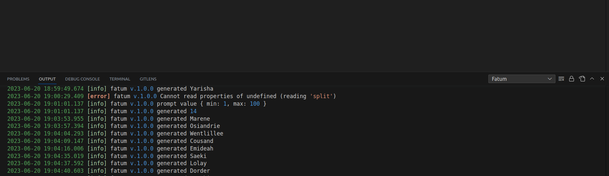

# winston-vscode
[winston][w-main] transport for [vscode extentions][vsc-ext].

[![Version][badge-vers]][npm]
[![Bundle size][npm-size-badge]][npm-size-url]
[![Downloads][npm-downloads-badge]][npm]

[![CodeFactor][codefactor-badge]][codefactor-url]
[![SonarCloud][sonarcloud-badge]][sonarcloud-url]
[![Codacy][codacy-badge]][codacy-url]
[![Scrutinizer][scrutinizer-badge]][scrutinizer-url]

[![Dependencies][badge-deps]][npm]
[![Security][snyk-badge]][snyk-url]
[![Build Status][tests-badge]][tests-url]
[![Coverage Status][badge-coverage]][url-coverage]

[![Commit activity][commit-activity-badge]][github]
[![FOSSA][fossa-badge]][fossa-url]
[![License][badge-lic]][github]
[![Made in Ukraine][ukr-badge]][ukr-link]

## 🇺🇦 Help Ukraine
I woke up on my 26th birthday at 5 am from the blows of russian missiles. They attacked the city of Kyiv, where I live, as well as the cities in which my family and friends live. Now my country is a war zone. 

We fight for democratic values, freedom, for our future! Once again Ukrainians have to stand against evil, terror, against genocide. The outcome of this war will determine what path human history is taking from now on.

💛💙  Help Ukraine! We need your support! There are [dozen ways][ukr-link] to help us, just do it!

## Table of Contents
- [winston-vscode](#winston-vscode)
  - [🇺🇦 Help Ukraine](#-help-ukraine)
  - [Table of Contents](#table-of-contents)
  - [Motivation](#motivation)
  - [Requirements](#requirements)
  - [Installation](#installation)
  - [Usage](#usage)
  - [Configuration](#configuration)
  - [Levels](#levels)
  - [Implementations](#implementations)
  - [Contribute](#contribute)

## Motivation

When developing VSCode extensions, it is not straightforward how to organize your logs. This package aims to help you use the [winston][w-main] logger in your VSCode application. It utilizes the  [OutputChannel][vsc-outputChannel] API under the hood. 

## Requirements
[![Platform Status][node-ver-test-badge]][node-ver-test-url]

To use library you need to have [node](https://nodejs.org) and [npm](https://www.npmjs.com) installed in your machine:

* node `>=10`
* npm `>=6`

Package is [continuously tested][node-ver-test-url] on darwin, linux and win32 platforms. All active and maintenance [LTS](https://nodejs.org/en/about/releases/) node releases are supported.

## Installation

To install the library run the following command

```bash
  npm i --save winston-vscode
```

## Usage
The package can be used alongside any other [winston transport][w-transports].


```javascript
import * as vscode from 'vscode';
import { createLogger } from 'winston';
import VSCTransport from 'winston-vscode';

const transport  = new VSCTransport({
    window : vscode.window,
    name   : 'Fatum'
});

const logger = createLogger({
    level      : 'info',
    transports : [ transport ]
});

logger.log('info', 'Extention activated');

```

A new container with logs will be added to the VSCode "Output" console.




## Configuration

Next options can be configured while transport creation:

* **name** - name of a extention, ```VSCTransport``` by default;
* **window** - (required) vscode window object;

## Levels

Visual Studio Code handles the following log levels: 'debug', 'info', 'warn', 'error', and 'trace'. For these log levels, native methods will be used. However, for any other custom log levels, the fallback "appendLine" method will be used.

## Implementations

Are you looking for more examples?

**Validation**
 * [fatum](https://github.com/pustovitDmytro/fatum-vscode/blob/master/src/logger.ts)
  
## Contribute

Make the changes to the code and tests. Then commit to your branch. Be sure to follow the commit message conventions. Read [Contributing Guidelines](.github/CONTRIBUTING.md) for details.

[npm]: https://www.npmjs.com/package/winston-vscode
[github]: https://github.com/pustovitDmytro/winston-vscode
[coveralls]: https://coveralls.io/github/pustovitDmytro/winston-vscode?branch=master
[badge-deps]: https://img.shields.io/librariesio/release/npm/winston-vscode.svg
[badge-vers]: https://img.shields.io/npm/v/winston-vscode.svg
[badge-lic]: https://img.shields.io/github/license/pustovitDmytro/winston-vscode.svg
[badge-coverage]: https://coveralls.io/repos/github/pustovitDmytro/winston-vscode/badge.svg?branch=master
[url-coverage]: https://coveralls.io/github/pustovitDmytro/winston-vscode?branch=master

[snyk-badge]: https://snyk-widget.herokuapp.com/badge/npm/winston-vscode/badge.svg
[snyk-url]: https://snyk.io/advisor/npm-package/winston-vscode

[tests-badge]: https://img.shields.io/circleci/build/github/pustovitDmytro/winston-vscode
[tests-url]: https://app.circleci.com/pipelines/github/pustovitDmytro/winston-vscode

[codefactor-badge]: https://www.codefactor.io/repository/github/pustovitdmytro/winston-vscode/badge
[codefactor-url]: https://www.codefactor.io/repository/github/pustovitdmytro/winston-vscode

[commit-activity-badge]: https://img.shields.io/github/commit-activity/m/pustovitDmytro/winston-vscode

[scrutinizer-badge]: https://scrutinizer-ci.com/g/pustovitDmytro/winston-vscode/badges/quality-score.png?b=master
[scrutinizer-url]: https://scrutinizer-ci.com/g/pustovitDmytro/winston-vscode/?branch=master

[codacy-badge]: https://app.codacy.com/project/badge/Grade/8667aa23afaa4725854f098c4b5e8890
[codacy-url]: https://www.codacy.com/gh/pustovitDmytro/winston-vscode/dashboard?utm_source=github.com&amp;utm_medium=referral&amp;utm_content=pustovitDmytro/winston-vscode&amp;utm_campaign=Badge_Grade

[sonarcloud-badge]: https://sonarcloud.io/api/project_badges/measure?project=pustovitDmytro_winston-vscode&metric=alert_status
[sonarcloud-url]: https://sonarcloud.io/dashboard?id=pustovitDmytro_winston-vscode

[npm-downloads-badge]: https://img.shields.io/npm/dw/winston-vscode
[npm-size-badge]: https://img.shields.io/bundlephobia/min/winston-vscode
[npm-size-url]: https://bundlephobia.com/result?p=winston-vscode

[node-ver-test-badge]: https://github.com/pustovitDmytro/winston-vscode/actions/workflows/npt.yml/badge.svg?branch=master
[node-ver-test-url]: https://github.com/pustovitDmytro/winston-vscode/actions?query=workflow%3A%22Node.js+versions%22

[fossa-badge]: https://app.fossa.com/api/projects/custom%2B24828%2Fwinston-vscode.svg?type=shield
[fossa-url]: https://app.fossa.com/projects/custom%2B24828%2Fwinston-vscode?ref=badge_shield

[ukr-badge]: https://img.shields.io/badge/made_in-ukraine-ffd700.svg?labelColor=0057b7
[ukr-link]: https://war.ukraine.ua

[w-main]: https://github.com/winstonjs/winston
[w-transports]: https://github.com/winstonjs/winston/blob/master/docs/transports.md
[vsc-ext]: https://code.visualstudio.com/api
[vsc-outputChannel]: https://code.visualstudio.com/api/references/vscode-api#LogOutputChannel